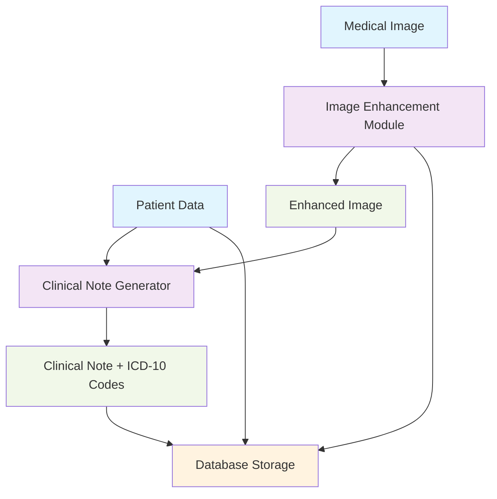

# System Architecture Diagram

## Data Flow Explanation

1. **Input**: Medical image and patient data are provided as inputs
2. **Image Enhancement**: The image enhancement module processes the medical image to improve diagnostic quality
3. **Clinical Documentation**: The enhanced image and patient data are used to generate clinical notes and extract ICD-10 codes
4. **Storage**: All data is stored in the database with proper relationships
5. **Output**: Enhanced results are available for clinical review and further processing